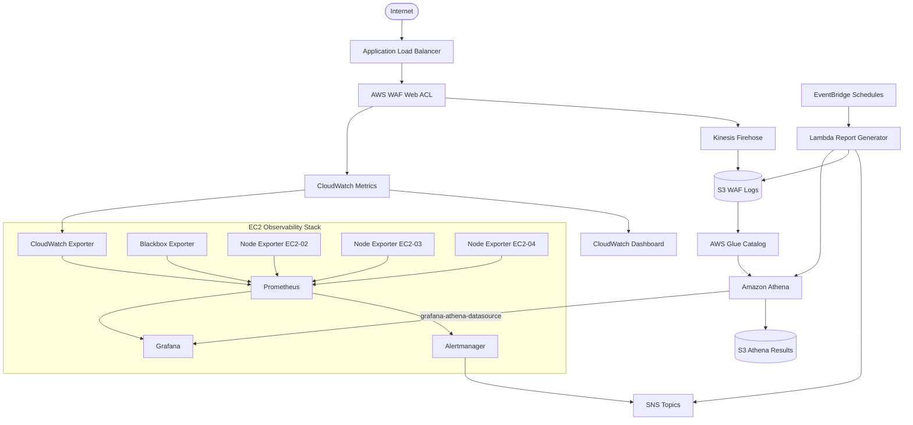
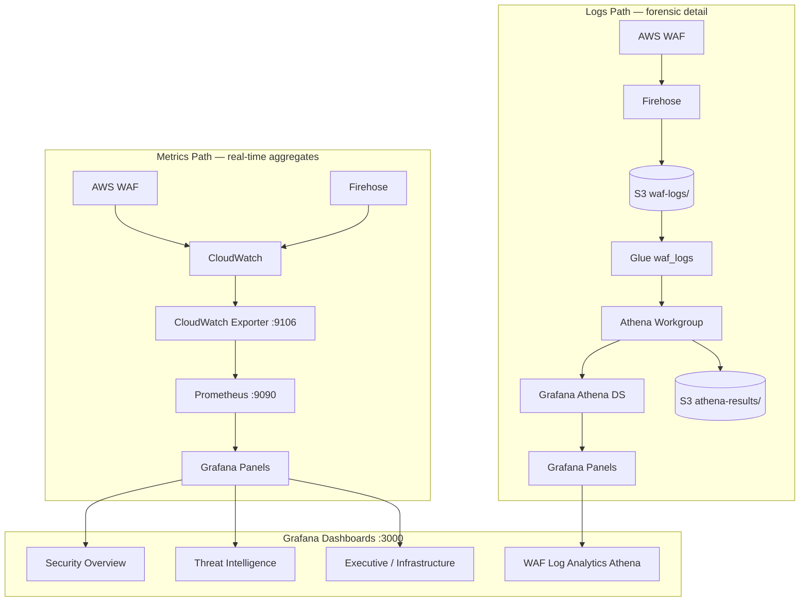
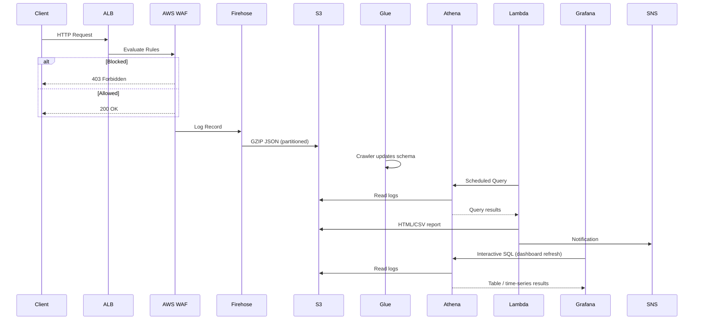
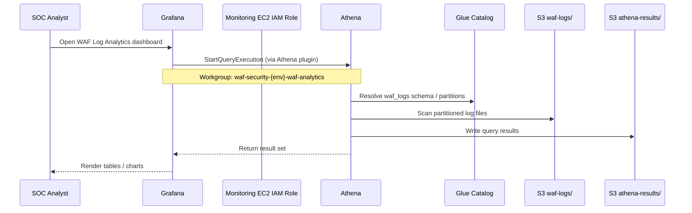
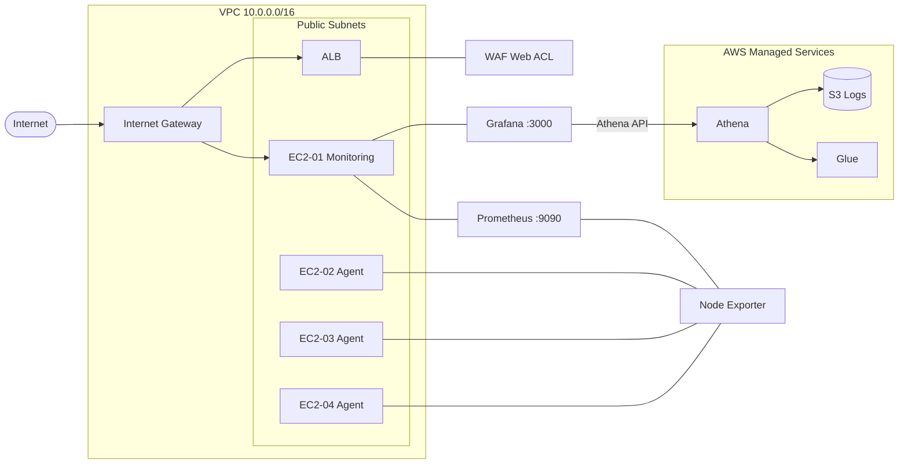
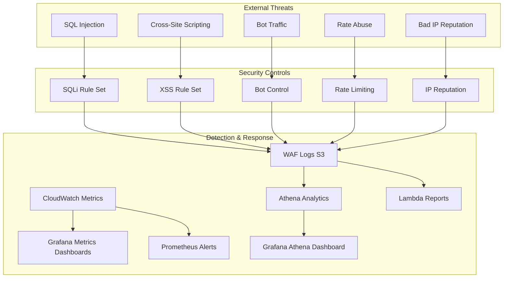
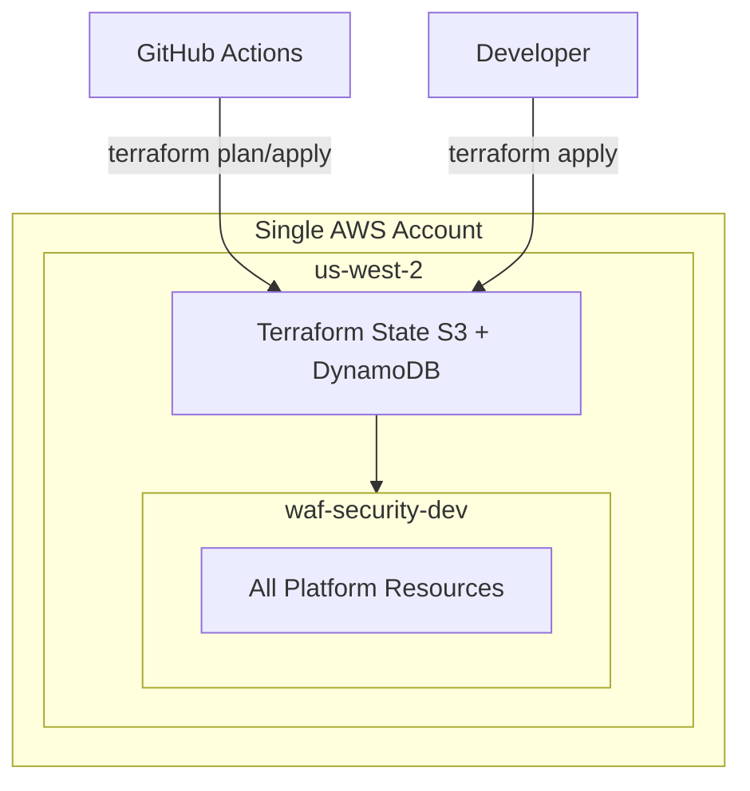

# Architecture Diagrams

## System Architecture

## Grafana Dual-Path Visualization

Grafana consumes **metrics** (Prometheus) and **logs** (Athena) through separate data sources.

## Data Flow Sequence

## Athena → Grafana Query Flow

## Network Diagram

## Threat Model Diagram

## Deployment Topology

## Related Documentation

- [High Level Design (HLD)](../docs/architecture/HLD.md)
- [Low Level Design (LLD)](../docs/architecture/LLD.md)
- [AWS Architecture Diagram (draw.io)](aws-architecture.drawio)
- [Grafana + Athena Guide](../docs/guides/grafana-athena-guide.md)
