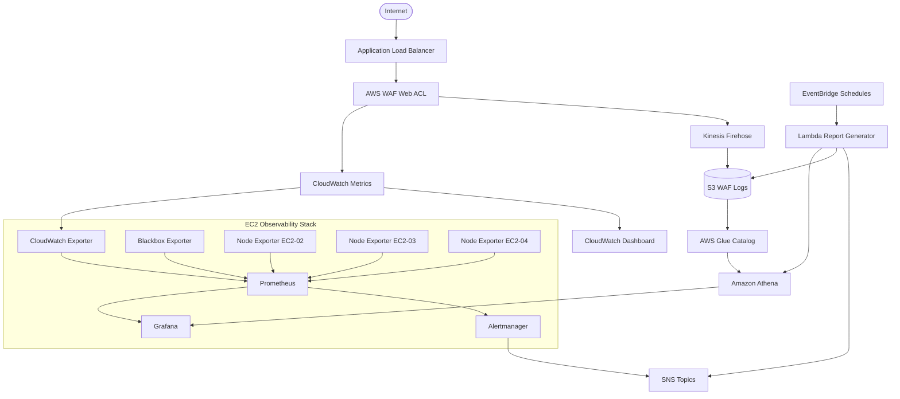
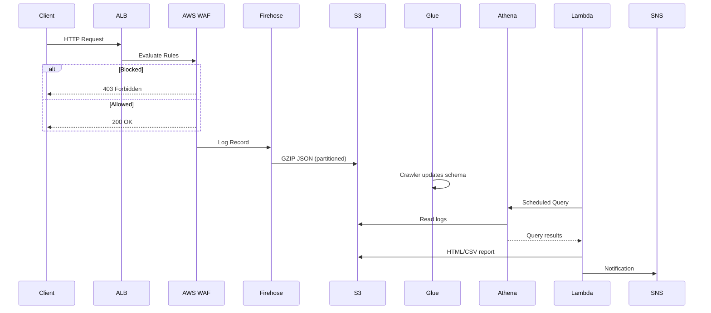
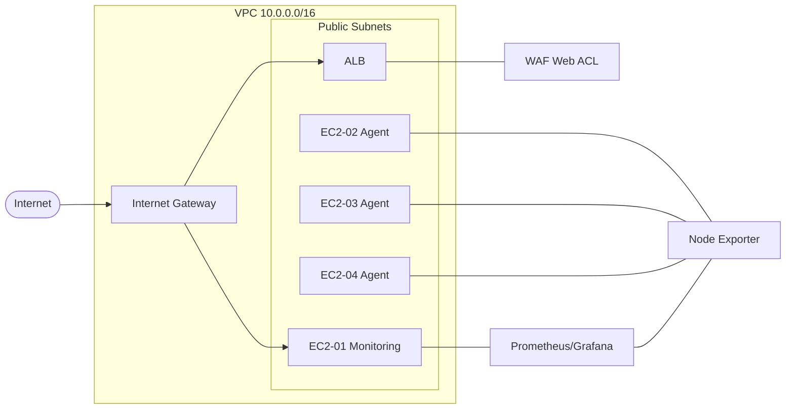
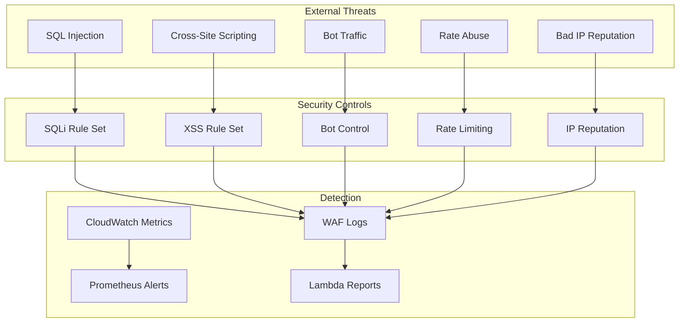
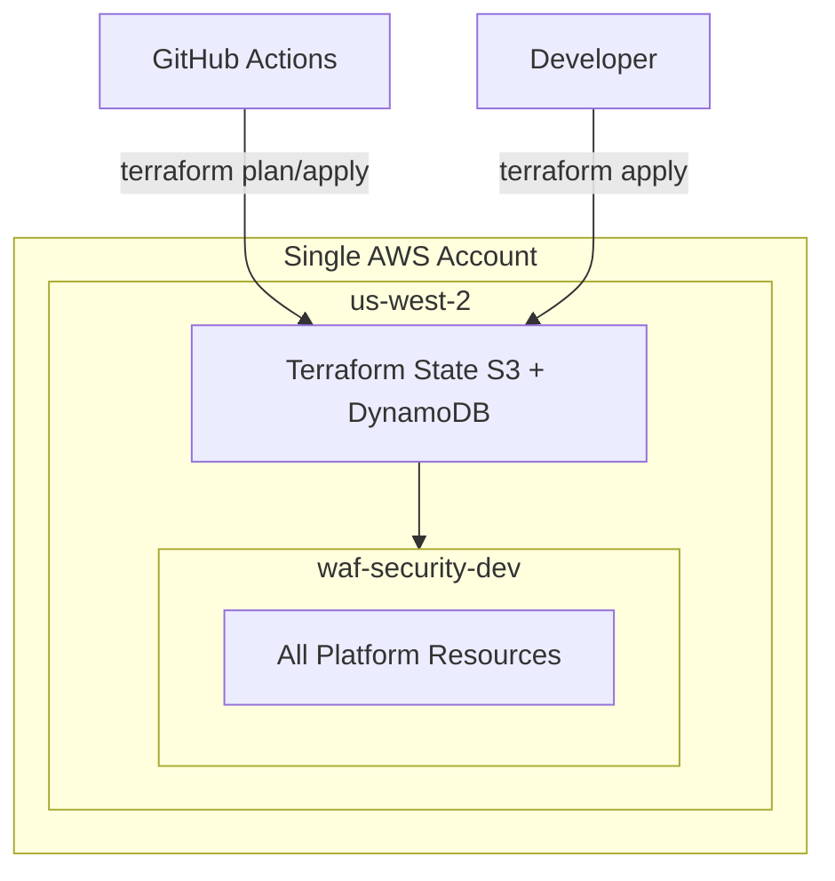

# Architecture Diagrams

## System Architecture

```mermaid
flowchart TB
    Internet([Internet])
    ALB[Application Load Balancer]
    WAF[AWS WAF Web ACL]
    CW[CloudWatch Metrics]
    FH[Kinesis Firehose]
    S3[(S3 WAF Logs)]
    Glue[AWS Glue Catalog]
    Athena[Amazon Athena]
    Lambda[Lambda Report Generator]
    EB[EventBridge Schedules]
    SNS[SNS Topics]
    CW_Dash[CloudWatch Dashboard]

    subgraph Observability["EC2 Observability Stack"]
        Prom[Prometheus]
        Graf[Grafana]
        AM[Alertmanager]
        CWE[CloudWatch Exporter]
        BBE[Blackbox Exporter]
        NE1[Node Exporter EC2-02]
        NE2[Node Exporter EC2-03]
        NE3[Node Exporter EC2-04]
    end

    Internet --> ALB
    ALB --> WAF
    WAF --> CW
    WAF --> FH
    FH --> S3
    S3 --> Glue
    Glue --> Athena
    EB --> Lambda
    Lambda --> Athena
    Lambda --> S3
    Lambda --> SNS
    Athena --> Graf
    CW --> CWE
    CWE --> Prom
    Prom --> Graf
    Prom --> AM
    AM --> SNS
    NE1 --> Prom
    NE2 --> Prom
    NE3 --> Prom
    BBE --> Prom
    CW --> CW_Dash
```

## Data Flow Sequence

```mermaid
sequenceDiagram
    participant C as Client
    participant ALB as ALB
    participant WAF as AWS WAF
    participant FH as Firehose
    participant S3 as S3
    participant G as Glue
    participant A as Athena
    participant L as Lambda

    C->>ALB: HTTP Request
    ALB->>WAF: Evaluate Rules
    alt Blocked
        WAF-->>C: 403 Forbidden
    else Allowed
        WAF-->>C: 200 OK
    end
    WAF->>FH: Log Record
    FH->>S3: GZIP JSON (partitioned)
    G->>G: Crawler updates schema
    L->>A: Scheduled Query
    A->>S3: Read logs
    A-->>L: Query results
    L->>S3: HTML/CSV report
    L->>SNS: Notification
```

## Network Diagram

```mermaid
flowchart LR
    subgraph VPC["VPC 10.0.0.0/16"]
        subgraph Public["Public Subnets"]
            ALB[ALB]
            MON[EC2-01 Monitoring]
            AG1[EC2-02 Agent]
            AG2[EC2-03 Agent]
            AG3[EC2-04 Agent]
        end
        IGW[Internet Gateway]
    end

    Internet([Internet]) --> IGW
    IGW --> ALB
    IGW --> MON
    ALB --- WAF[WAF Web ACL]
    MON --- Prom[Prometheus/Grafana]
    AG1 --- NE[Node Exporter]
    AG2 --- NE
    AG3 --- NE
    Prom --- NE
```

## Threat Model Diagram

```mermaid
flowchart TD
    subgraph External["External Threats"]
        SQLi[SQL Injection]
        XSS[Cross-Site Scripting]
        Bot[Bot Traffic]
        DDoS[Rate Abuse]
        Reputation[Bad IP Reputation]
    end

    subgraph Controls["Security Controls"]
        WAF_R[SQLi Rule Set]
        WAF_X[XSS Rule Set]
        WAF_B[Bot Control]
        WAF_RL[Rate Limiting]
        WAF_IP[IP Reputation]
    end

    subgraph Detection["Detection"]
        Logs[WAF Logs]
        Metrics[CloudWatch Metrics]
        Alerts[Prometheus Alerts]
        Reports[Lambda Reports]
    end

    SQLi --> WAF_R
    XSS --> WAF_X
    Bot --> WAF_B
    DDoS --> WAF_RL
    Reputation --> WAF_IP
    WAF_R --> Logs
    WAF_X --> Logs
    WAF_B --> Logs
    WAF_RL --> Logs
    WAF_IP --> Logs
    Logs --> Reports
    Metrics --> Alerts
```

## Deployment Topology

```mermaid
flowchart TB
    subgraph AWS["Single AWS Account"]
        subgraph Region["us-west-2"]
            TF[Terraform State S3 + DynamoDB]
            subgraph Stack["waf-security-dev"]
                All[All Platform Resources]
            end
        end
    end

    GH[GitHub Actions] -->|terraform plan/apply| TF
    TF --> Stack
    Dev[Developer] -->|terraform apply| TF
```
