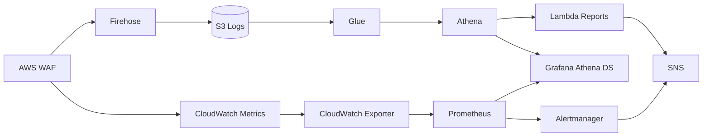

# High Level Design (HLD)

## 1. Overview

The AWS WAF Security Intelligence & Observability Platform provides centralized monitoring, analytics, reporting, and alerting for AWS WAF-protected applications in a single AWS account.

## 2. Business Objectives

| Objective | Solution Component |
|-----------|-------------------|
| Collect WAF logs | WAF logging → Firehose → S3 |
| Store logs securely | S3 + KMS encryption + lifecycle |
| Analyze attack patterns | Glue + Athena |
| Generate reports | Lambda + EventBridge + SNS |
| Visualize attacks (metrics) | CloudWatch + Grafana (Prometheus) dashboards |
| Visualize attacks (logs) | Grafana + Athena (WAF log analytics dashboard) |
| Monitor infrastructure | Prometheus + Node Exporter |
| Alert security teams | CloudWatch Alarms + Alertmanager + SNS |
| Support multiple environments | Terraform environments (dev/test/prod) |

## 3. Architecture Components

### 3.1 Security Layer
- **AWS WAF Web ACL** attached to Application Load Balancer
- Managed rule groups: Common, SQLi, Known Bad Inputs, IP Reputation, Rate Limiting
- Optional Bot Control (disabled by default in sandbox due to cost)

### 3.2 Data Ingestion Layer
- **Kinesis Data Firehose** delivers WAF logs to S3
- GZIP compression, dynamic partitioning (year/month/day)
- CloudWatch logging for delivery monitoring

### 3.3 Storage & Catalog Layer
- **S3** with versioning, KMS encryption, lifecycle policies
- **AWS Glue** database, table schema, and scheduled crawler

### 3.4 Analytics Layer
- **Amazon Athena** workgroup with encrypted query results
- 11 named queries for threat intelligence

### 3.5 Reporting Layer
- **Lambda** (Python 3.12) triggered by EventBridge schedules
- Generates HTML and CSV reports, delivers via SNS

### 3.6 Observability Layer (EC2-based)
- **Monitoring Server**: Prometheus, Grafana, Alertmanager, CloudWatch Exporter, Blackbox Exporter
- **Grafana data sources**: Prometheus (default), CloudWatch, Athena (`grafana-athena-datasource` plugin)
- **Grafana dashboards**:
  - *Metrics*: Security Overview, Threat Intelligence, Executive, Infrastructure Monitoring (Prometheus / CloudWatch)
  - *Logs*: WAF Log Analytics (Athena) — top attackers, countries, URIs, SQLi/XSS attempts
- **Agent Nodes** (×3): Node Exporter for infrastructure metrics

### 3.7 Alerting Layer
- CloudWatch metric alarms (block rate, SQLi surge, Firehose failures)
- Prometheus alert rules (security + infrastructure)
- Alertmanager routing by severity (critical/high/medium/low)

## 4. Data Flow

### 4.1 Request & Log Pipeline
1. Client requests hit ALB
2. WAF evaluates rules, allows or blocks
3. WAF emits CloudWatch metrics (BlockedRequests, AllowedRequests)
4. WAF logs stream to Firehose → S3 (partitioned by year/month/day)
5. Glue crawler updates the `waf_logs` catalog table

### 4.2 Analytics & Reporting Pipeline
6. Athena queries analyze logs in S3 (workgroup + named queries)
7. Lambda generates scheduled HTML/CSV reports via Athena → SNS
8. Grafana queries Athena directly for interactive log analytics dashboards

### 4.3 Metrics & Alerting Pipeline
9. CloudWatch Exporter scrapes WAF, Firehose, Lambda, and ALB metrics → Prometheus
10. Node Exporter and Blackbox Exporter provide infrastructure and ALB health metrics
11. Grafana visualizes Prometheus metrics; Alertmanager routes alerts to SNS

## 5. Environment Strategy

| Environment | Purpose | Bot Control | Instance Size |
|-------------|---------|-------------|---------------|
| dev | Development/testing | Off | t3.medium |
| test | Pre-production validation | Off | t3.medium |
| prod | Production workloads | Optional | t3.large+ |

## 6. Non-Goals (Sandbox)

- Multi-account log aggregation
- AWS Organizations
- Amazon Managed Prometheus/Grafana
- Amazon OpenSearch
- Cross-account IAM roles

## 7. Grafana Visualization Model

Grafana provides a unified UI with two complementary data paths:

| Path | Source | Dashboard examples | Use case |
|------|--------|-------------------|----------|
| **Metrics** | CloudWatch → Prometheus | Security Overview, Threat Intelligence, Executive | Real-time block rates, rule trends, infra health |
| **Logs** | S3 → Glue → Athena | WAF Log Analytics (Athena) | Forensics: IPs, URIs, countries, attack details |

See [Grafana + Athena Guide](../guides/grafana-athena-guide.md) for setup and troubleshooting.

## 8. Compliance Alignment

- **AWS Well-Architected**: Security, Reliability, Performance, Cost, Operations
- **CIS AWS Foundations**: Encryption, logging, least privilege IAM
- **NIST 800-53**: AU (audit), SI (system integrity), SC (communications protection)
- **ISO 27001**: A.12 Operations security, A.14 System acquisition
