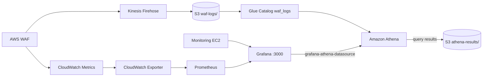

# Grafana + Athena WAF Log Analytics Guide

This guide explains how WAF log analytics are exposed in Grafana using the **Amazon Athena data source**, how the components fit together, and how to access, verify, and troubleshoot the **WAF Log Analytics (Athena)** dashboard.

## Overview

The platform uses two complementary observability paths:

| Path | Data source | Best for |
|------|-------------|----------|
| **Prometheus dashboards** | CloudWatch metrics (via CloudWatch Exporter) | Real-time block/allow rates, infrastructure health |
| **Athena dashboard** | WAF request logs in S3 (via Glue + Athena) | Forensics: IPs, URIs, countries, rule IDs, attack patterns |

Prometheus answers *"how many blocks happened?"* Athena answers *"who was blocked, from where, and on which URI?"*

## Architecture



### Data flow (logs → Grafana)

1. WAF logs **BLOCK** and **COUNT** actions to Kinesis Firehose.
2. Firehose writes GZIP JSON to S3: `waf-logs/year=YYYY/month=MM/day=DD/`.
3. AWS Glue defines the external table `waf_logs` (partitioned by year, month, day).
4. Grafana on the monitoring EC2 uses the **Athena plugin** to run SQL against `waf_logs`.
5. Query results are written to `s3://<bucket>/athena-results/` and rendered in dashboard panels.

## Components

### Grafana Athena data source

Provisioned automatically on the monitoring EC2 during deployment.

| Setting | Example (dev) |
|---------|---------------|
| Plugin | `grafana-athena-datasource` |
| Catalog | `AwsDataCatalog` |
| Database | `waf_security_dev_waf` |
| Table | `waf_logs` |
| Workgroup | `waf-security-dev-waf-analytics` |
| Output location | `s3://waf-security-dev-waf-logs-<account_id>/athena-results/` |
| Authentication | EC2 instance profile (IAM role) |

Config files:

- `observability/grafana/provisioning/datasources/datasources.yml` — reference config for the repo
- `/opt/observability/grafana/provisioning/datasources/datasources.yml` — live config on the monitoring EC2 (generated by `scripts/deployment/user_data_monitoring.sh`)

### Dashboard: WAF Log Analytics (Athena)

| Property | Value |
|----------|-------|
| Title | WAF Log Analytics (Athena) |
| UID | `waf-athena-analytics` |
| Folder | WAF Security |
| Refresh | 5 minutes |
| Source JSON | `dashboards/grafana/athena-log-analytics.json` |

#### Panels

| Panel | Visualization | Athena query focus |
|-------|---------------|-------------------|
| Total Requests | Stat | Count of all WAF log events in time range |
| Blocked Requests | Stat | `action = 'BLOCK'` count |
| Allowed Requests | Stat | `action = 'ALLOW'` count |
| Block Rate % | Gauge | Blocked / total percentage |
| Hourly Traffic Trend | Time series | Total vs blocked per hour |
| SQLi / XSS Blocks by Hour | Time series | Blocks by rule pattern |
| Top Attackers | Table | Top client IPs by block count |
| Top Countries | Table | Requests and blocks by country |
| SQLi Attempts | Table | Blocked SQLi by IP and URI |
| XSS Attempts | Table | Blocked XSS/BadInputs by IP and URI |
| Recent Blocked Requests | Table | Latest 100 block events with details |

All panels use the `$__timeFilter(from_unixtime(timestamp/1000))` macro so results respect the Grafana time picker.

### IAM permissions

The EC2 monitoring instance profile (`ec2-monitoring-role`) includes permissions for:

- `athena:StartQueryExecution`, `GetQueryResults`, `GetWorkGroup`, etc.
- `glue:GetDatabase`, `GetTable`, `GetPartitions`
- `s3:GetObject`, `PutObject`, `ListBucket` on the WAF logs and Athena results buckets
- `kms:Decrypt` for encrypted S3 objects

Defined in `terraform/modules/iam/main.tf`.

## Accessing Grafana

After deployment:

```bash
cd terraform/environments/dev
terraform output grafana_url
# Example: http://<monitoring-eip>:3000
```

Default credentials (change after first login):

- **Username:** `admin`
- **Password:** `ChangeMe123!`

Open the dashboard:

**Dashboards → WAF Security → WAF Log Analytics (Athena)**

Or browse directly: `http://<grafana-host>:3000/d/waf-athena-analytics`

## Verify the setup

### 1. Confirm WAF logs exist in S3

```bash
BUCKET=$(cd terraform/environments/dev && terraform output -raw s3_bucket_name)
aws s3 ls "s3://${BUCKET}/waf-logs/" --recursive | tail -5
```

If empty, generate test traffic:

```bash
ALB_URL=$(cd terraform/environments/dev && terraform output -raw alb_dns_name)
python scripts/attack_simulation/simulate_sqli.py --url "http://${ALB_URL}" --count 20
python scripts/attack_simulation/simulate_xss.py --url "http://${ALB_URL}" --count 20
```

Wait 5–10 minutes for Firehose buffering and delivery.

### 2. Run the Glue crawler

```bash
aws glue start-crawler \
  --name waf-security-dev-waf-logs-crawler \
  --region us-west-2
```

### 3. Test Athena directly (optional)

```bash
WORKGROUP=$(cd terraform/environments/dev && terraform output -raw athena_workgroup)
DATABASE="waf_security_dev_waf"

aws athena start-query-execution \
  --work-group "$WORKGROUP" \
  --query-execution-context "Database=${DATABASE}" \
  --query-string "SELECT COUNT(*) FROM waf_logs WHERE year = date_format(current_date, '%Y') AND month = date_format(current_date, '%m')" \
  --result-configuration "OutputLocation=s3://${BUCKET}/athena-results/"
```

### 4. Test the Grafana Athena data source

1. Open **Connections → Data sources → Athena**
2. Click **Save & test**
3. Expected: *"Data source is working"*

### 5. Open the dashboard

Set the time range to **Last 24 hours** and confirm panels populate after logs are available.

## Deployment scenarios

### New deployment (Terraform)

Athena integration is configured automatically when the monitoring EC2 is created:

1. `terraform apply` provisions Athena, Glue, S3, and the monitoring stack.
2. `user_data_monitoring.sh` installs the Athena plugin, provisions the data source, and loads the dashboard JSON.

No manual import is required for fresh deployments.

### Existing monitoring EC2 (already running)

If the monitoring server was deployed before Athena support was added:

**Option A — Re-deploy monitoring instance (recommended)**

```bash
cd terraform/environments/dev
terraform taint 'module.monitoring.aws_instance.monitoring_server'
terraform apply
```

**Option B — Run the fix script on the EC2**

```bash
# SSH or SSM into the monitoring EC2, then:
sudo bash /opt/observability/fix_grafana_metrics.sh
```

Then manually import the dashboard if it is not present:

1. Grafana → **Dashboards → New → Import**
2. Upload `dashboards/grafana/athena-log-analytics.json`
3. Replace `__ATHENA_DATABASE__` in panel queries with your Glue database name (e.g. `waf_security_dev_waf`)

**Option C — Manual import only**

Import `dashboards/grafana/athena-log-analytics.json` via the Grafana UI and ensure the Athena data source is configured under **Connections → Data sources**.

## Prometheus vs Athena dashboards

| Question | Use this dashboard |
|----------|-------------------|
| Current block rate spike? | Grafana **Security Overview** (Prometheus / CloudWatch) |
| Which IPs are attacking? | **WAF Log Analytics (Athena)** |
| Is Firehose delivering logs? | **Infrastructure Monitoring** (Prometheus) |
| Top targeted URIs? | **WAF Log Analytics (Athena)** |
| ALB health / node CPU? | **Infrastructure Monitoring** (Prometheus) |

See also: [SOC Analyst Guide](../operations/soc-analyst-guide.md) for investigation workflows.

## Troubleshooting

### Dashboard panels show "No data"

| Check | Action |
|-------|--------|
| No S3 log files | Generate traffic; wait for Firehose delivery (~5 min) |
| Glue table empty / stale | Run the Glue crawler |
| Athena query returns 0 rows | Widen Grafana time range; confirm logs exist for that period |
| Data source test fails | Verify EC2 instance profile has Athena/Glue/S3 IAM permissions |
| Plugin missing | Confirm `GF_INSTALL_PLUGINS=grafana-athena-datasource` in docker-compose on EC2 |

### Athena query errors in Grafana

- **Access Denied on S3:** EC2 role needs `s3:PutObject` on `athena-results/` prefix.
- **Table not found:** Glue database name mismatch — check `terraform output` and data source settings.
- **HIVE_PARTITION_SCHEMA_MISMATCH:** Run the Glue crawler to refresh partitions.

### Queries are slow or costly

Athena charges per data scanned. The dashboard queries use `$__timeFilter()` to limit rows, but you should still:

- Keep partition columns (`year`, `month`, `day`) in mind for ad-hoc queries
- Avoid very wide time ranges (e.g. 90 days) on table panels
- Review scanned bytes in the Athena console or CloudWatch `AWS/Athena` metrics

See [Cost Estimation](cost-estimation.md) for Athena cost guidance.

## Related Documentation

- [High Level Design (HLD)](../architecture/HLD.md)
- [Low Level Design (LLD)](../architecture/LLD.md)
- [Architecture Diagrams](../../diagrams/architecture.md)

## Related Files

| Path | Purpose |
|------|---------|
| `dashboards/grafana/athena-log-analytics.json` | Athena dashboard definition |
| `observability/grafana/provisioning/datasources/datasources.yml` | Data source reference config |
| `observability/grafana/provisioning/dashboards/dashboards.yml` | Dashboard provisioning config |
| `scripts/deployment/user_data_monitoring.sh` | EC2 bootstrap (plugin, datasource, dashboard) |
| `scripts/deployment/fix_grafana_metrics.sh` | Repair script for existing EC2 deployments |
| `athena/queries/` | Standalone Athena SQL for console/CLI use |
| `terraform/modules/athena/` | Athena workgroup and named queries |
| `terraform/modules/iam/main.tf` | EC2 monitoring IAM permissions |

## Environment-specific names

Replace `dev` with your environment (`test`, `prod`) as needed:

| Resource | Naming pattern |
|----------|----------------|
| Glue database | `waf_security_<env>_waf` |
| Athena workgroup | `waf-security-<env>-waf-analytics` |
| S3 bucket | `waf-security-<env>-waf-logs-<account_id>` |
| Firehose stream | `aws-waf-logs-waf-security-<env>` |
